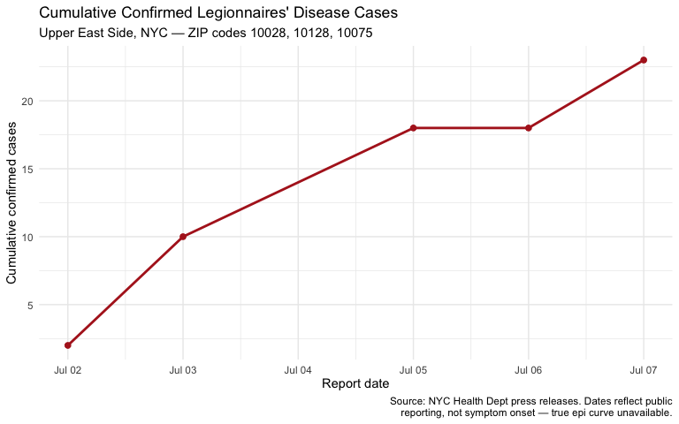
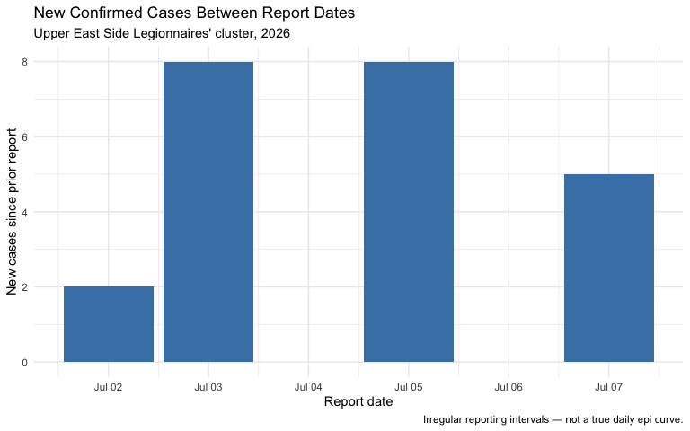

Upper East Side Legionnaires’ Disease Cluster: Epi Curve Analysis
================
Elizabeth Meehan, MPH
July 07, 2026

- [Background](#background)
- [Data and Methods](#data-and-methods)
  - [Known data limitation](#known-data-limitation)
- [Cumulative Case Curve](#cumulative-case-curve)
- [New Cases Between Reports](#new-cases-between-reports)
- [Discussion](#discussion)
- [References](#references)

## Background

In early July 2026, the NYC Health Department identified a community
cluster of Legionnaires’ disease on Manhattan’s Upper East Side,
centered on ZIP codes 10028, 10128, and 10075 (Carnegie Hill, Yorkville,
and Lenox Hill; New York City Department of Health and Mental Hygiene,
2026). The suspected source is a cooling tower in the affected area,
though as of this writing no confirmed match has been made via
whole-genome sequencing (Lewis, 2026). No deaths have been reported
(“Legionnaires’ cluster grows to 23 cases,” 2026). Health officials have
also advised anyone who visited the east side of Central Park between
East 76th and East 97th Streets since late June to monitor for symptoms
(Durkee, 2026).

This document tracks the cumulative case count as reported through NYC
Health Department press releases and news coverage. See the References
section for full APA citations.

## Data and Methods

``` r
ues_legionnaires <- tibble(
  report_date = as.Date(c("2026-07-02", "2026-07-03", "2026-07-05",
                           "2026-07-06", "2026-07-07")),
  cumulative_cases = c(2, 10, 18, 18, 23),
  source_url = c(
    "https://www.nyc.gov/site/doh/about/press/pr2026/nyc-health-dept-investigating-legionnaires-cluster-ues.page",
    "https://ny1.com/nyc/all-boroughs/news/2026/07/06/legionnaires--cluster-grows-to-14-cases-on-upper-east-side",
    "https://ny1.com/nyc/all-boroughs/politics/2026/07/06/18-legionnaires-cases-upper-east-side-",
    "https://www.amny.com/news/legionnaires-disease-outbreak-upper-east-side-07062026/",
    "https://ny1.com/nyc/all-boroughs/health/2026/07/07/legionnaires--cluster-upper-east-side-new-york-city-2026"
  )
) %>%
  mutate(new_cases = cumulative_cases - lag(cumulative_cases, default = 0))

ues_legionnaires %>%
  select(report_date, cumulative_cases, new_cases) %>%
  knitr::kable(col.names = c("Report date", "Cumulative cases", "New cases since prior report"))
```

| Report date | Cumulative cases | New cases since prior report |
|:------------|-----------------:|-----------------------------:|
| 2026-07-02  |                2 |                            2 |
| 2026-07-03  |               10 |                            8 |
| 2026-07-05  |               18 |                            8 |
| 2026-07-06  |               18 |                            0 |
| 2026-07-07  |               23 |                            5 |

### Known data limitation

Unlike NNDSS-sourced projects, no public line-list or case-level
dashboard was available for this outbreak at the time of analysis. As a
result:

- **Dates reflect when cases were publicly reported, not date of symptom
  onset.** This is a reporting curve, not a true epidemic curve by date
  of illness onset.
- **Reporting intervals are irregular** (not daily), so the “new cases”
  values represent cases accumulated between press releases, not daily
  incidence.
- Counts may be revised in later reporting as cases are confirmed,
  reclassified, or ruled out; figures here reflect the count as of each
  cited source’s publication time.
- If NYC Health later publishes a case-level dataset via its [open data
  portal](https://www.nyc.gov/site/doh/data/data-home.page), that source
  should supersede this compiled dataset for any further analysis.

## Cumulative Case Curve

``` r
p_cumulative <- ggplot(ues_legionnaires, aes(x = report_date, y = cumulative_cases)) +
  geom_line(color = "firebrick", linewidth = 1) +
  geom_point(size = 2, color = "firebrick") +
  scale_x_date(date_breaks = "1 day", date_labels = "%b %d") +
  labs(
    title = "Cumulative Confirmed Legionnaires' Disease Cases",
    subtitle = "Upper East Side, NYC — ZIP codes 10028, 10128, 10075",
    x = "Report date", y = "Cumulative confirmed cases",
    caption = "Source: NYC Health Dept press releases. Dates reflect public\nreporting, not symptom onset — true epi curve unavailable."
  ) +
  theme_minimal()

p_cumulative
```

<!-- -->

``` r
ggsave("../output/ues_legionnaires_cumulative_curve.png",
       plot = p_cumulative, width = 8, height = 5, dpi = 300)
```

## New Cases Between Reports

``` r
p_new_cases <- ggplot(ues_legionnaires, aes(x = report_date, y = new_cases)) +
  geom_col(fill = "steelblue") +
  scale_x_date(date_breaks = "1 day", date_labels = "%b %d") +
  labs(
    title = "New Confirmed Cases Between Report Dates",
    subtitle = "Upper East Side Legionnaires' cluster, 2026",
    x = "Report date", y = "New cases since prior report",
    caption = "Irregular reporting intervals — not a true daily epi curve."
  ) +
  theme_minimal()

p_new_cases
```

<!-- -->

``` r
ggsave("../output/ues_legionnaires_new_cases.png",
       plot = p_new_cases, width = 8, height = 5, dpi = 300)
```

## Discussion

As of July 07, 2026, 23 cases have been confirmed, with no reported
deaths (“Legionnaires’ cluster grows to 23 cases,” 2026). The largest
single jump in reported cases (2 to 10) followed the health department’s
public alert urging providers to test suspected pneumonia cases for
*Legionella* (Russo-Lennon, 2026) — a reminder that jumps in a
reporting-based curve can reflect surveillance intensity as much as
underlying transmission. This mirrors a broader pattern seen in
provisional surveillance data generally: case counts early in an
investigation should be read as a floor, not a ceiling, on the true
scope of an outbreak.

This cluster follows a considerably larger and more severe Legionnaires’
outbreak in Central Harlem the previous summer, which sickened more than
100 people and resulted in seven deaths (“Legionnaires cluster grows to
18 cases,” 2026).

## References

Durkee, A. (2026, July 6). Legionnaire’s outbreak hits Upper East
Side—Central     Park visitors should monitor for symptoms. *Forbes*.
    <https://www.forbes.com/sites/alisondurkee/2026/07/06/central-park-visitors-warned-as-nyc-faces-legionnaires-outbreak/>

Legionnaires cluster grows to 18 cases on the Upper East Side. (2026,
July 6).     *NY1*.
<https://ny1.com/nyc/all-boroughs/politics/2026/07/06/18-legionnaires-cases-upper-east-side->

Legionnaires’ cluster grows to 14 cases on Upper East Side. (2026, July
6).     *NY1*.
<https://ny1.com/nyc/all-boroughs/news/2026/07/06/legionnaires--cluster-grows-to-14-cases-on-upper-east-side>

Legionnaires’ cluster grows to 23 cases on Upper East Side. (2026, July
7).     *NY1*.
<https://ny1.com/nyc/all-boroughs/health/2026/07/07/legionnaires--cluster-upper-east-side-new-york-city-2026>

Lewis, C. (2026, July 7). Here’s what to know about the Legionnaires’
disease     outbreak on the Upper East Side. *Gothamist*.
    <https://gothamist.com/news/heres-what-to-know-about-the-legionnaires-disease-outbreak-on-the-upper-east-side>

New York City Department of Health and Mental Hygiene. (2026, July 2).
NYC     Health Department investigating community cluster of
Legionnaires’     disease on the Upper East Side \[Press release\].
    <https://www.nyc.gov/site/doh/about/press/pr2026/nyc-health-dept-investigating-legionnaires-cluster-ues.page>

Russo-Lennon, B. (2026, July 6). Legionnaires’ disease outbreak on Upper
East     Side climbs to 18 cases, officials say. *amNewYork*.
    <https://www.amny.com/news/legionnaires-disease-outbreak-upper-east-side-07062026/>

*Note.* APA style typically renders references with a hanging indent;
the non-breaking spaces above approximate this in rendered
Markdown/HTML. If knitting to PDF via LaTeX, consider using a `csl` file
(e.g., via the `citr` or `papaja` packages) for properly formatted
hanging indents instead.

------------------------------------------------------------------------

*This analysis was developed with AI assistance (Claude, Anthropic) for
code structure and drafting; data compilation, source verification, and
analytical interpretation were reviewed independently.*
